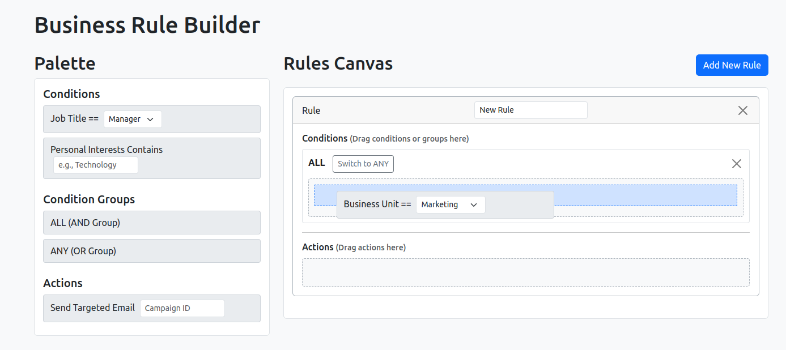
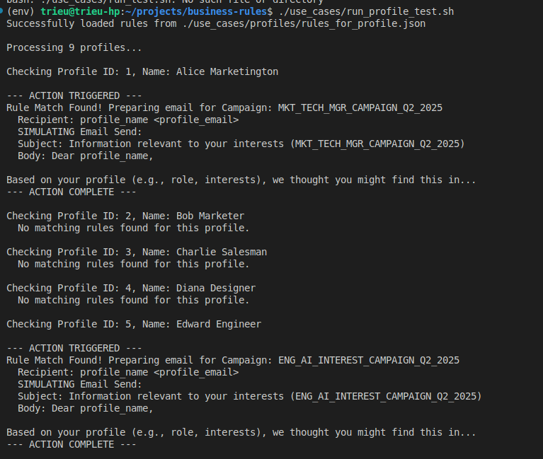
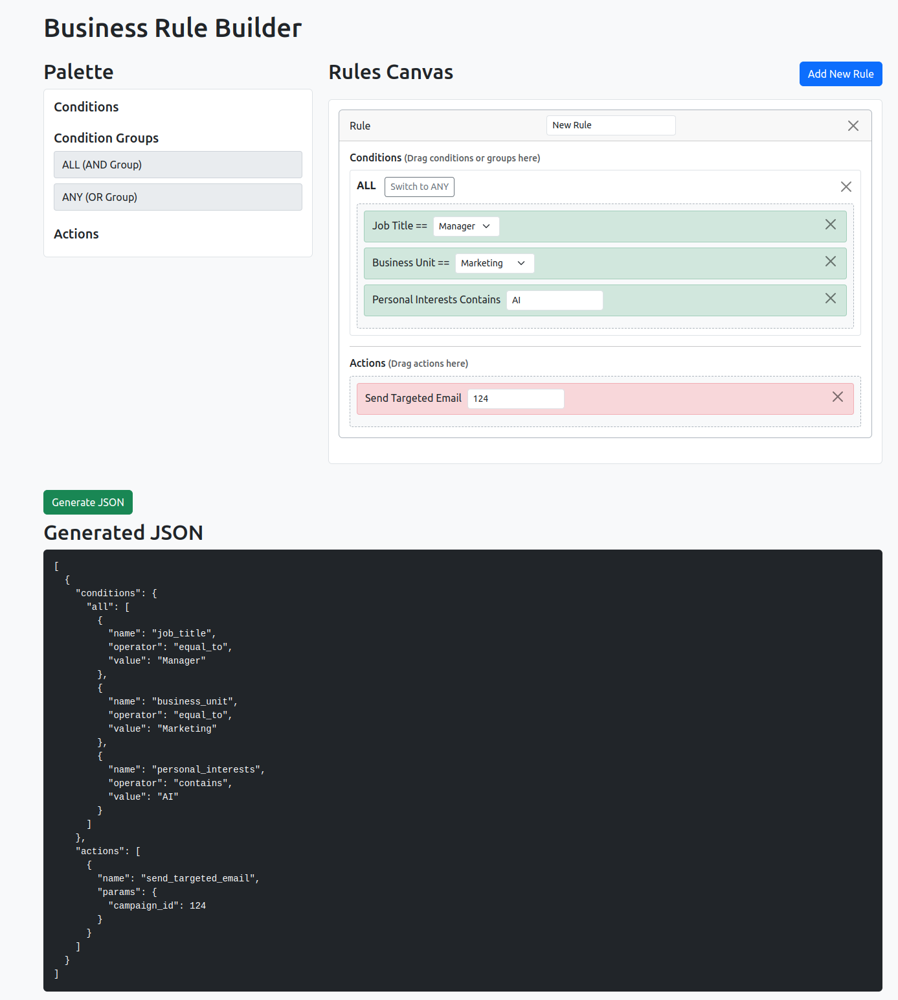

# Use Case Testing for business-rules library

## Rules Builder UI


## Rules Action Running Logs


## System requirements

- Python 3.10+
- FastAPI
- Pydantic  
- Business Rules Engine https://pypi.org/project/business-rules/
- PostgreSQL 15 to store JSON rules

## Installation

1. Clone the repository:
```bash
   git clone https://github.com/trieu/business-rules
```

2. Create env
```bash
    python -m venv env
    source env/bin/activate
```

3. Install the dependencies:
```bash
   pip install -r requirements.txt
```

4. Run profile test:
```bash
   ./use_cases/run_profile_test.sh
   
```

## JSON rule data model
```json
[
    {
        "rule_name": "Marketing Managers interested in Technology",
        "conditions": {
            "all": [
                {
                    "name": "business_unit",
                    "operator": "equal_to",
                    "value": "Marketing"
                },
                {
                    "name": "job_title",
                    "operator": "equal_to",
                    "value": "Manager"
                },
                {
                    "name": "personal_interests",
                    "operator": "contains",
                    "value": "Technology"
                }
            ]
        },
        "actions": [
            {
                "name": "send_targeted_email",
                "params": {
                    "recipient_email": "profile_email",
                    "recipient_name": "profile_name",
                    "campaign_id": "MKT_TECH_MGR_CAMPAIGN_Q2_2025"
                }
            }
        ]
    },
    {
        "rule_name": "Any Engineer interested in AI",
        "conditions": {
            "all": [
                {
                    "name": "business_unit",
                    "operator": "equal_to",
                    "value": "Engineering"
                },
                {
                    "name": "personal_interests",
                    "operator": "contains",
                    "value": "AI"
                }
            ]
        },
        "actions": [
            {
                "name": "send_targeted_email",
                "params": {
                    "recipient_email": "profile_email",
                    "recipient_name": "profile_name",
                    "campaign_id": "ENG_AI_INTEREST_CAMPAIGN_Q2_2025"
                }
            }
        ]
    }
]
```



